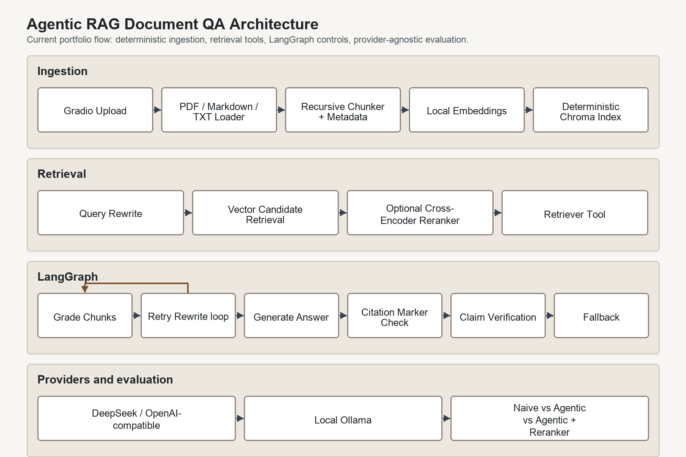

# Reliability-oriented Agentic RAG Document QA System

基于 LangGraph 的 Agentic RAG 智能文档问答系统，用于面向私有知识库的 PDF / Markdown / TXT 文档问答。

Reliability-oriented Agentic RAG Document QA System is a LangGraph-based document question answering project that upgrades naive retrieve-generate RAG into a stateful Agent workflow. It integrates structured query transformation, optional hybrid retrieval, reranking, retrieval grading, conditional retry, fallback handling, citation-aware answer generation, lightweight claim verification, evaluation artifacts, and ablation scaffolding to improve reliability, explainability, debuggability, and evaluability in complex document QA scenarios.

The project is production-oriented as an architecture and evaluation exercise, but it is not described as production-ready. Authentication, authorization, deployment hardening, and full observability are intentionally left for later milestones.

## Why This Is Not a Naive RAG Demo

A naive RAG pipeline usually follows one fixed path:

```text
question -> retrieve -> generate answer
```

This project makes the retrieval process agentic:

```text
question
-> query transformation
-> retriever tool
-> retrieval grading
-> conditional retry
-> grounded answer with citations
```

The agent checks whether retrieved chunks can actually answer the question. If they are not relevant enough, it rewrites the retrieval query and retries before falling back with a clear unable-to-answer response.

The system keeps a strict distinction between the original user question and the retrieval query. `current_query` is optimized for search; grading and answer generation still target the original user question.

## Architecture



```text
UI Layer
  Gradio document upload, indexing, QA, citations, retrieved chunks, diagnostics

RAG Layer
  loader -> chunker -> embeddings -> Chroma vector store
  dense retrieval + optional BM25 retrieval + RRF fusion + optional reranker

Agent Layer
  LangGraph state -> nodes -> conditional edges -> answer or fallback

Evaluation Layer
  eval_questions.json -> baseline/agentic runners -> JSON artifacts -> report
```

## Agent Workflow

```text
START
-> rewrite_query
-> retrieve
-> grade_documents
-> if relevant: generate_answer -> END
-> if no relevant chunks and retry_count < max_retry_count: rewrite_query
-> if no relevant chunks and retry_count >= max_retry_count: fallback -> END
```

Implemented LangGraph nodes:

- `rewrite_query_node`: performs structured query transformation on the first attempt, then uses failed retrieval context for retry rewrites.
- `retrieve_node`: calls the `retrieve_context` tool over the private Chroma index.
- `grade_documents_node`: asks the LLM for chunk-level `relevant_indices`, then filters `relevant_documents`.
- `generate_answer_node`: generates JSON answers from relevant chunks, checks citation marker consistency, maps `used_citation_indices` to evidence, and verifies cited claims before returning normal answers.
- `fallback_node`: returns a clear message when the indexed documents do not support an answer.

Key state fields:

- `current_query`: query currently used for retrieval.
- `standalone_question`: standalone retrieval-ready version of the user question.
- `query_transform`: structured query transformation record.
- `query_transform_strategy`: one of `rewrite`, `multi_query`, or `decomposition`.
- `expanded_queries`: complementary retrieval queries used by multi-query retrieval.
- `sub_questions`: decomposition sub-questions recorded for future multi-hop retrieval.
- `retrieval_queries`: actual queries executed by the retriever node.
- `multi_query_used`: whether the retriever node executed more than one query.
- `multi_query_result_count`: number of unique chunks after multi-query merge.
- `question`: original user question. Grading and answer generation use this as the target.
- `previous_queries`: retrieval queries already attempted.
- `retrieval_attempt`: number of retriever-node executions.
- `retry_count`: number of failed-retrieval rewrites. Initial query normalization does not count as retry.
- `documents`: raw retrieved chunks.
- `relevant_documents`: chunks accepted by retrieval grading.
- `grading_reason`: LLM reason for accepting or rejecting retrieved evidence.
- `citations`: final answer evidence chunks selected by `used_citation_indices`.
- `claims`: claim-level verification records extracted from the final answer.
- `is_verified`: whether normal answer claims were verified against selected citation chunks.

## Features

- PDF, Markdown, and TXT document loading.
- Recursive chunking with source, source path, file hash, page, and chunk id metadata.
- Local sentence-transformers embeddings by default.
- Persistent Chroma vector store with deterministic chunk IDs, explicit rebuild, and incremental add support.
- Optional hybrid retrieval: dense vector search and BM25 sparse search are fused with Reciprocal Rank Fusion before grading.
- Retriever exposed as an Agent tool named `retrieve_context`.
- Optional cross-encoder reranker: retrieve candidate chunks, rerank them, then pass the strongest chunks to grading.
- Reranker diagnostics: the reranker can emit structured records with document id, chunk id, original score, rerank score, rank, content, and metadata.
- Structured query transformation with direct rewrite, multi-query retrieval execution, and decomposition metadata.
- Chunk-level retrieval grading with conservative handling for invalid grading output.
- Conditional retry with configurable max retry count.
- Citation-aware grounded answer generation using only selected evidence chunks.
- Citation safety: normal answers without valid supporting citation indices or matching answer citation markers fall back instead of returning unsupported answers.
- Lightweight claim-level verification: normal cited answers are split into claims and checked against selected citation chunks.
- Gradio UI for upload, indexing, question answering, citations, retrieved chunks, and retry diagnostics.
- Naive RAG baseline package and CLI for retrieve-once comparison.
- Reliability evaluation runner comparing naive RAG and Agentic RAG on shared documents and a shared structured question set.
- JSON evaluation artifacts for baseline, agentic, comparison, and ablation runs.
- Ablation framework with explicit proxy/pending labels for modules that do not yet have independent toggles.

## Tech Stack

- Python 3.11+
- LangGraph
- LangChain
- ChromaDB
- sentence-transformers
- OpenAI-compatible chat LLM
- Ollama local LLM via OpenAI-compatible endpoint
- Gradio
- python-dotenv
- pytest

## Quick Start

Create a virtual environment:

```bash
python3 -m venv .venv
```

Install dependencies:

```bash
.venv/bin/python -m pip install -r requirements.txt
```

Create an environment file:

```bash
cp .env.example .env
```

Set your chat LLM config in `.env`.

For OpenAI, DeepSeek, or another OpenAI-compatible remote API:

```bash
LLM_PROVIDER=openai_compatible
OPENAI_API_KEY=your_api_key
OPENAI_BASE_URL=https://api.openai.com/v1
OPENAI_MODEL=gpt-4o-mini
```

For local Ollama:

```bash
ollama pull qwen2.5:7b
ollama serve
```

Then set:

```bash
LLM_PROVIDER=ollama
OLLAMA_BASE_URL=http://localhost:11434
OLLAMA_MODEL=qwen2.5:7b
```

Ollama mode uses the local OpenAI-compatible endpoint at `/v1` internally and does not require `OPENAI_API_KEY`.

Start the Gradio UI:

```bash
.venv/bin/python app.py
```

If you activate the virtual environment first, `python app.py` also works:

```bash
source .venv/bin/activate
python app.py
```

## Usage

1. Open the Gradio URL printed by `app.py`.
2. Upload one or more `.pdf`, `.md`, `.markdown`, or `.txt` files.
3. Click `Build Index`.
4. Ask a question about the indexed documents.
5. Inspect:
   - answer
   - citations
   - retrieved chunks
   - rewritten question
   - retry count
   - retrieval diagnostics

The chat LLM is required for query rewriting, retrieval grading, answer generation, and claim verification. If the selected provider is missing required configuration, the app returns a clear configuration error instead of producing offline fake answers.

## Hybrid Retrieval Pipeline

P1a adds a configurable retrieval path for term-sensitive document QA:

```text
query
+-- dense retriever top-k from Chroma
+-- BM25 sparse retriever top-k over indexed chunks
+-- RRF fusion
    -> optional reranker
    -> retrieval grading
    -> answer generation or fallback
```

This path is disabled by default to preserve the original dense retrieval behavior. Enable it with:

```bash
HYBRID_RETRIEVAL_ENABLED=true
DENSE_TOP_K=20
BM25_TOP_K=20
FUSION_TOP_K=20
```

Dense retrieval is useful for semantic similarity. BM25 improves recall for exact terms such as filenames, abbreviations, identifiers, and domain-specific keywords. RRF deduplicates overlapping chunks by `chunk_id` and combines rank signals without requiring dense and sparse scores to be on the same scale.

The current BM25 implementation is dependency-free and intentionally lightweight. It uses token-level exact matching without stemming or learned sparse expansion.

## Tests

Run the test suite:

```bash
.venv/bin/python -m pytest -q
```

Tests use fake LLMs and mocked vector stores, so they do not require real OpenAI-compatible API calls.

## Evaluation

P0a builds the evaluation infrastructure first. The current runner compares naive RAG and Agentic RAG on the same 36-question structured dataset and can write reproducible JSON artifacts.

Run comparison evaluation:

```bash
.venv/bin/python -m evaluation.evaluate \
  --questions evaluation/eval_questions.json \
  --output-dir experiments/results
```

Run the naive baseline only:

```bash
.venv/bin/python -m baseline.run_baseline \
  --questions evaluation/eval_questions.json \
  --output experiments/results/baseline_result.json
```

Run the ablation framework:

```bash
.venv/bin/python -m experiments.run_ablation \
  --questions evaluation/eval_questions.json \
  --output-dir experiments/results
```

Evaluation compares:

- `Naive RAG`: question -> retrieve -> generate.
- `Agentic RAG`: question -> rewrite -> retrieve -> grade -> retry or answer.

Generated artifacts:

- `experiments/results/baseline_result.json`
- `experiments/results/agentic_result.json`
- `experiments/results/comparison_result.json`
- `experiments/results/ablation_result.json`
- `experiments/results/ablation_report.md`
- `experiments/report.md`

Evaluation artifacts include a sanitized `runtime_config` snapshot covering model name, temperature, retriever settings, hybrid retrieval settings, reranker settings, and vector collection name. API keys, base URLs, local persistence paths, and other secrets are intentionally excluded.

Metric fields include:

- `answer_rate`
- `correctness_score`
- `context_relevance_score`
- `source_hit_rate`
- `citation_hit_rate`
- `fallback_accuracy`
- `unsupported_claim_count`
- `supported_claim_ratio`
- `citation_verification_pass_rate`
- `average_retry_count`
- `average_latency`
- `average_token_usage`
- `estimated_cost`
- `error_count`

If the LLM config or vector index is missing, evaluation records errors per question and still prints a report.

The P0a report is an infrastructure checkpoint. Final results should be regenerated in P0b after the P1/P2 retrieval and verification upgrades. Current ablation rows that use `current_agentic_workflow` are proxy runs, not proof that each module has already been independently toggled.

## Example Output

Example answer payload:

```json
{
  "answer": "Agentic RAG uses query rewriting and retrieval grading to improve document QA.",
  "citations": [
    {
      "source": "notes.md",
      "page": null,
      "chunk_id": "notes.md:pNA:c1",
      "score": 0.91
    }
  ],
  "rewritten_question": "What is Agentic RAG?",
  "current_query": "What is Agentic RAG?",
  "retry_count": 0,
  "retrieval_attempt": 1,
  "is_relevant": true
}
```

Example evaluation summary:

```text
Evaluation Report

Comparison Summary

| Metric | Naive RAG | Agentic RAG |
|---|---:|---:|
| Source Hit Rate | 0.6 | 0.8 |
| Keyword Hit Rate | 0.5 | 0.7 |
| Citation Rate | 0.55 | 0.75 |
| Fallback Correctness | 0.7 | 0.85 |
| Avg Latency | 2.1 | 4.8 |
```

## Environment Variables

- `LLM_PROVIDER`: `openai_compatible` for remote OpenAI-compatible APIs, or `ollama` for local Ollama.
- `LLM_TEMPERATURE`: Chat model temperature. Default is `0`.
- `OPENAI_API_KEY`: API key for the OpenAI-compatible remote LLM.
- `OPENAI_BASE_URL`: Base URL for the OpenAI-compatible API.
- `OPENAI_MODEL`: Remote chat model used by the agent.
- `OLLAMA_BASE_URL`: Local Ollama server URL. Default is `http://localhost:11434`.
- `OLLAMA_MODEL`: Local Ollama model name, such as `qwen2.5:7b`.
- `EMBEDDING_PROVIDER`: Embedding backend. MVP default is `sentence_transformers`.
- `EMBEDDING_MODEL`: Local embedding model. Default is `sentence-transformers/all-MiniLM-L6-v2`.
- `CHUNK_SIZE`: Text chunk size.
- `CHUNK_OVERLAP`: Text chunk overlap.
- `TOP_K`: Number of chunks retrieved per query.
- `HYBRID_RETRIEVAL_ENABLED`: Enable dense + BM25 retrieval with RRF fusion. Default is `false`.
- `DENSE_TOP_K`: Number of dense vector candidates used by hybrid retrieval.
- `BM25_TOP_K`: Number of sparse keyword candidates used by hybrid retrieval.
- `FUSION_TOP_K`: Number of fused candidates kept before optional reranking.
- `RERANKER_ENABLED`: Enable optional cross-encoder reranking. Default is `false`.
- `RERANKER_MODEL`: Cross-encoder model used when reranking is enabled.
- `RERANKER_TOP_N`: Number of chunks kept after reranking when no explicit `top_k` is passed.
- `RERANKER_CANDIDATE_TOP_K`: Number of dense or fused candidates retrieved before reranking.
- `MAX_RETRY_COUNT`: Maximum failed-retrieval retry rewrites.
- `CHROMA_PERSIST_DIR`: Local Chroma persistence path.
- `CHROMA_COLLECTION_NAME`: Chroma collection name.
- `GRADIO_SERVER_NAME`: Gradio host.
- `GRADIO_SERVER_PORT`: Gradio port.

## Project Structure

```text
agentic-rag-document-qa/
├── app.py
├── main.py
├── config.py
├── requirements.txt
├── .env.example
├── README.md
├── rag/
│   ├── loader.py
│   ├── chunker.py
│   ├── embeddings.py
│   ├── vectorstore.py
│   ├── bm25_retriever.py
│   ├── fusion.py
│   ├── hybrid_retriever.py
│   ├── retriever.py
│   └── reranker.py
├── agent/
│   ├── graph.py
│   ├── state.py
│   ├── nodes.py
│   ├── edges.py
│   ├── multi_query.py
│   ├── query_transform.py
│   ├── tools.py
│   └── prompts.py
├── baseline/
│   ├── naive_rag.py
│   └── run_baseline.py
├── evaluation/
│   ├── baselines.py
│   ├── eval_questions.json
│   ├── evaluate.py
│   └── runtime_config.py
├── experiments/
│   ├── run_ablation.py
│   ├── configs/
│   └── report.md
├── docs/
│   ├── design.md
│   └── resume_bullets.md
├── ui/
│   └── gradio_app.py
├── assets/
│   └── architecture.png
├── sample_docs/
│   ├── agentic_rag_notes.md
│   ├── retrieval_pipeline_notes.md
│   ├── citation_verification_notes.md
│   ├── evaluation_notes.md
│   └── distractor_company_policy.md
└── tests/
```

## Resume Highlights

- Built a LangGraph-based Agentic RAG workflow that upgrades naive retrieve-generate RAG into a state-machine pipeline with structured query transformation, multi-query retrieval, hybrid retrieval, reranking, retrieval grading, conditional retry, citation-aware generation, lightweight verification, and fallback.
- Implemented a configurable dense retrieval + BM25 sparse retrieval + RRF fusion pipeline so the system can combine semantic recall with exact keyword, filename, and identifier matching.
- Added reranker evaluation readiness with explicit candidate top-k vs final top-n settings, structured reranker records, and sanitized runtime config snapshots in evaluation artifacts.
- Added a standalone naive RAG baseline and comparison runner so Agentic RAG can be evaluated against retrieve-once RAG on the same documents and same questions.
- Designed a reliability evaluation foundation covering correctness, context relevance, source hit rate, citation hit rate, fallback accuracy, unsupported claims, retry count, latency, token usage, and cost fields.
- Expanded the default evaluation dataset to 36 structured questions across single-doc, multi-chunk, ambiguous, unanswerable, distractor, comparison, follow-up, citation-sensitive, cross-file, and false-premise cases.
- Added ablation-study scaffolding with explicit proxy/pending labels, preventing current full-workflow runs from being misrepresented as independently toggled module results.
- Preserved a modular roadmap toward hybrid retrieval, real reranker ablation, structured retrieval grading, claim-level citation verification, trace logging, FastAPI service APIs, workspace isolation, and an interactive evaluation dashboard.

## Current Limitations

- Claim-level citation verification is lightweight and LLM-based. It checks claims against selected evidence chunks, but it is not a formal proof system.
- Citation marker consistency is deterministic, but it only checks marker/index alignment. It does not prove that every cited claim is true.
- Retrieval grading depends on LLM JSON output. The parser is defensive, but malformed grading output is treated conservatively.
- Query transformation executes `expanded_queries` for `multi_query` strategy, but decomposition `sub_questions` are still recorded as metadata rather than executed as separate retrieval hops.
- Hybrid BM25 retrieval is lightweight exact-token matching. It does not currently include stemming, learned sparse expansion, or per-workspace corpus filtering.
- Evaluation uses a local 36-question reliability dataset. It is useful for reproducible project-level comparison, but it is not a benchmark-grade public dataset.
- P0a ablation configs are framework-ready. Some current rows are proxy runs over the full Agentic RAG workflow because independent module toggles will be added later.
- Token usage and estimated cost are recorded only when the active model client exposes usage metadata.
- The Gradio `Build Index` workflow intentionally rebuilds the active collection for a clean uploaded knowledge base. The lower-level vectorstore API also supports incremental `add_documents` with deterministic IDs.
- The project is not production-ready without authentication, authorization, deployment hardening, persistent trace storage, and operational monitoring.

## Roadmap

- RAG core implemented: loading, chunking, embeddings, Chroma indexing, and retrieval.
- LangGraph agent workflow implemented: query transformation, retriever tool, retrieval grading, retry routing, answer generation, and fallback.
- Gradio upload and QA flow implemented: document indexing, Agentic QA, citations, retrieved chunks, and retry diagnostics.
- P0a evaluation infrastructure implemented: naive baseline, richer schema, 36-question dataset, reliability metrics, JSON artifacts, and ablation scaffolding.
- Claim-level verification implemented: cited normal answers are checked against selected evidence before being returned.
- Deterministic citation marker consistency implemented: answer markers must match selected citation indices.
- Deterministic vectorstore IDs implemented: chunk identity is derived from source metadata and content for incremental add de-duplication.
- Optional reranker implemented: vector retrieval can over-retrieve candidates, apply a local cross-encoder reranker, and pass reranked chunks into grading.
- P1a hybrid retrieval implemented: dense retrieval, BM25 sparse retrieval, RRF fusion, and configurable dense/BM25/fusion top-k values.
- P1b reranker evaluation readiness implemented: explicit `RERANKER_TOP_N`, structured reranker records, and sanitized runtime config snapshots in evaluation/ablation artifacts.
- P1c structured query transformation implemented: direct rewrite, multi-query expansion metadata, decomposition metadata, and result payload fields.
- P1d multi-query retrieval execution implemented: `expanded_queries` are retrieved, de-duplicated, and merged with matched-query diagnostics before grading.
- Ollama local LLM support implemented through `LLM_PROVIDER=ollama`.
- P0b: regenerate baseline, agentic, and ablation artifacts after P1/P2 algorithm upgrades, then update `experiments/report.md` with observed trade-offs.
- Upgrade evaluation to Approach B: split dataset loading, schemas, metrics, runners, reporting, and result IO into dedicated modules with typed records and prompt/model config snapshots.
- Add independently toggleable reranker and citation-verification ablations.
- Add structured retrieval grading with relevance labels, confidence, reasons, and state-level routing decisions.
- Upgrade lightweight verification into full claim-level citation verification with extraction, verification, revision, and fallback loops.
- Add decomposition sub-question retrieval for multi-hop workflows.
- Add FastAPI API layer.
- Add trace logging for node state changes, route decisions, final answers, citations, latency, token usage, and errors.
- Add workspace and multi-knowledge-base isolation using workspace IDs and collection or metadata filtering.
- Add an interactive Evaluation Dashboard in Gradio for running evaluations, comparing baseline vs agentic results, inspecting failed cases, and later linking rows to trace IDs.
- Add model-specific prompt tuning and cost/latency evaluation for local and remote models.
- Add human-reviewed claim labels for stricter citation validation.
